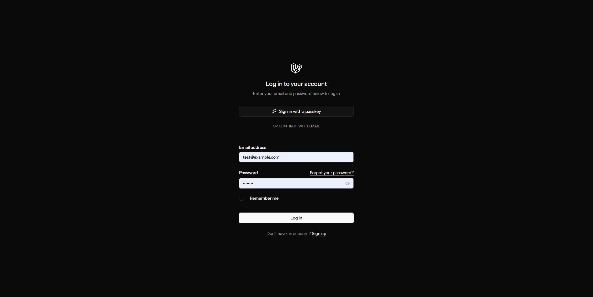
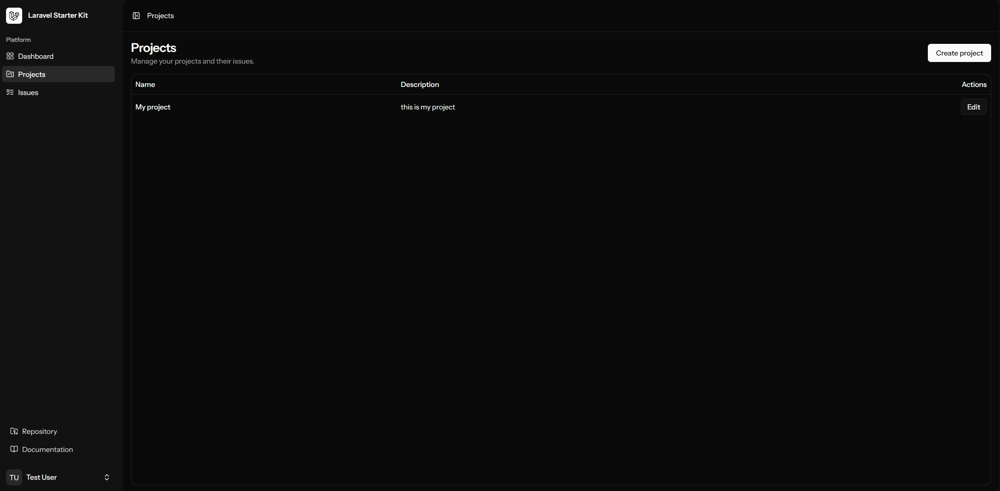
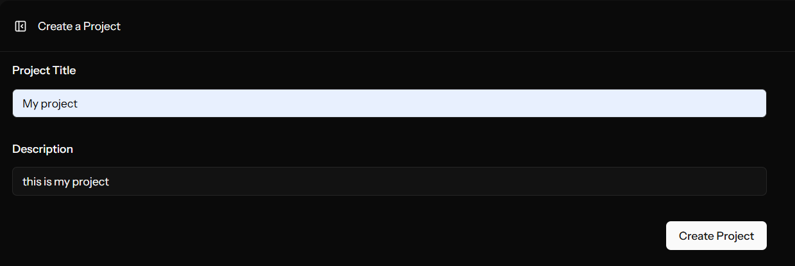
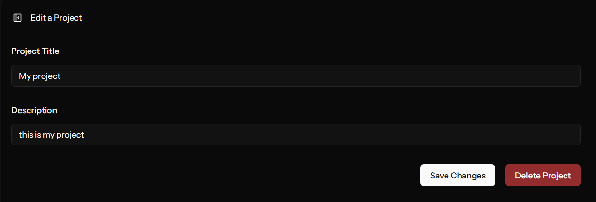
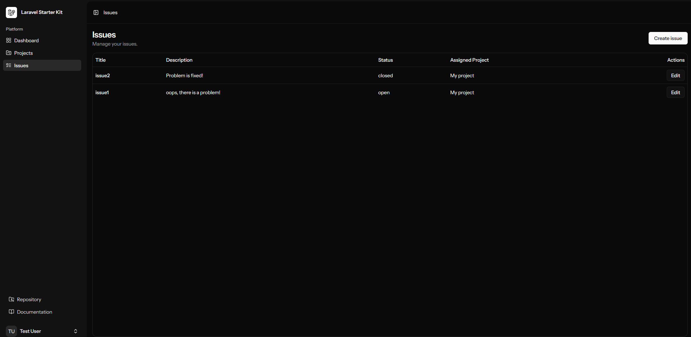
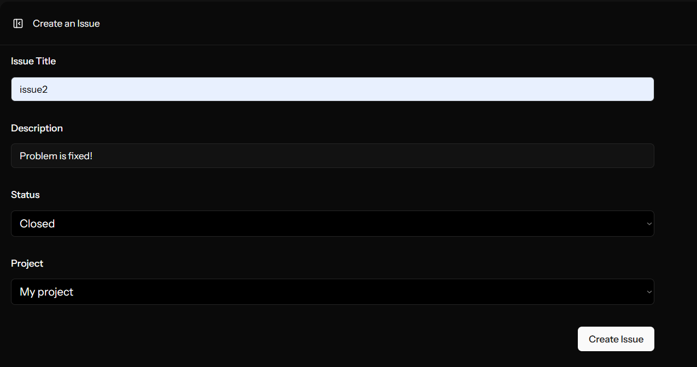
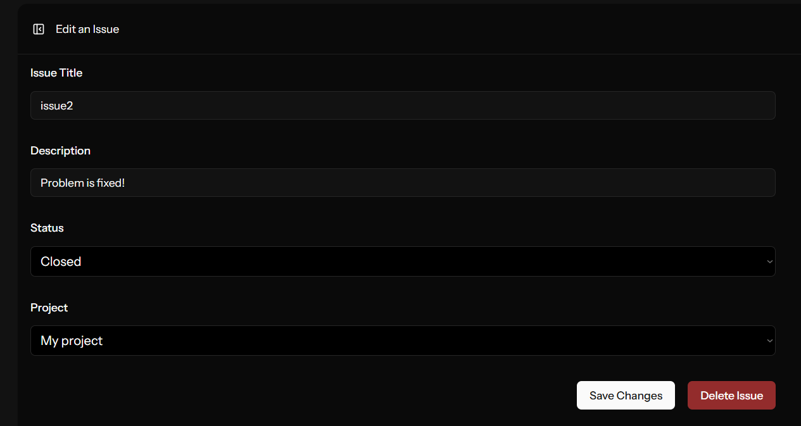

# Digi Media Internship Task (G1) - Ričards Bezbailis

---

### Task description

Create a small CRUD prototype for “projects” and “issues”. You may use plain PHP or a framework. Validation and prepared statements/ORM are required.

---

### Features

#### Projects:

- Create projects,
- View projects,
- Edit projects,
- Delete projects.

#### Issues:

- Create issues,
- View issues,
- Edit issues,
- Delete issues,
- Associate issues with projects.

---

### Stack

- Laravel
- MySQL
- Vue.js
- Inertia.js
- Docker

---

### Requirements

- Docker
- Docker Compose
- Composer
- Node.js

---

### Setup

```
git clone <repository-url>

cd digimedia-task

cp .env.example .env

composer install

npm install

./vendor/bin/sail up -d

./vendor/bin/sail artisan key:generate

./vendor/bin/sail artisan migrate:fresh --seed

npm run dev
```

---

### Running the site

Run the site:

```
./vendor/bin/sail up -d
```

Stop containers:

```
./vendor/bin/sail down
```

Run database migrations:  

```
./vendor/bin/sail artisan migrate
```

The site will be accessible at  [http://localhost](http://localhost)

---

### Authentication

Authentication can be performed with a test user (usable only by using --seed upon running database migration):

```txt
Email: test@example.com
Password: password
```

---

### Database structure

Projects:


| Column      | Type      |
| ----------- | --------- |
| id          | bigint    |
| title       | string    |
| description | text      |
| created_at  | timestamp |
| updated_at  | timestamp |


Issues:


| Column      | Type        |
| ----------- | ----------- |
| id          | bigint      |
| project_id  | foreign key |
| title       | string      |
| description | text        |
| status      | enum        |
| created_at  | timestamp   |
| updated_at  | timestamp   |


---

### Components

- Projects
- Issues

---

### Validation

Validation is implemented using Laravel request validation.

Examples:

- Project title is required
- Issue title must be at least 5 characters
- Issue status must be one of:
  - open
  - in_progress
  - closed
- project_id must reference an existing project

---

### ORM/Security

Laravel Eloquent ORM is used for database interaction, which internally uses prepared statements and protects against SQL injection.

### API routes


| Method | Endpoint       | Description    |
| ------ | -------------- | -------------- |
| GET    | /projects      | List projects  |
| POST   | /projects      | Create project |
| PUT    | /projects/{id} | Update project |
| DELETE | /projects/{id} | Delete project |
| GET    | /issues        | List issues    |
| POST   | /issues        | Create issue   |
| PUT    | /issues/{id}   | Update issue   |
| DELETE | /issues/{id}   | Delete issue   |


---

### Potential improvements

- Creating a card design for projects.
- Add a project details page displaying all associated issues.
- Add automated tests.
- Add filtering and searching for issues and projects.

---

### Screenshots

#### Login Page



#### Projects Pages




#### Issues Pages



